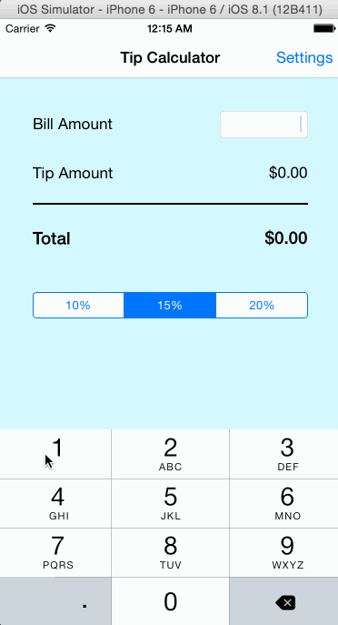

# Tip Calculator iOS app

This is an iOS app to calculate Tips (10, 15, 20). It calculates the totoal bill amount based of the selected tip percetage. It also allows the user to store default values for tip percentage

Time Spent : 4 hours

Completed user Stories

* [x] Required : User can add the bill amount in a text field 

* [x] Required : Tip is calculated based of a percetage selection

* [x] Required : Total bill amount is displayed.

* [x] Required : Settings page designed includes the ability to select the default tip percentage.

* [x] Required : The value selected in the settings page is used to calculate the tip on the view load.

Notes:

Walkthrough of all user stories:

GIF created with [LiceCap](http://www.cockos.com/licecap/).
